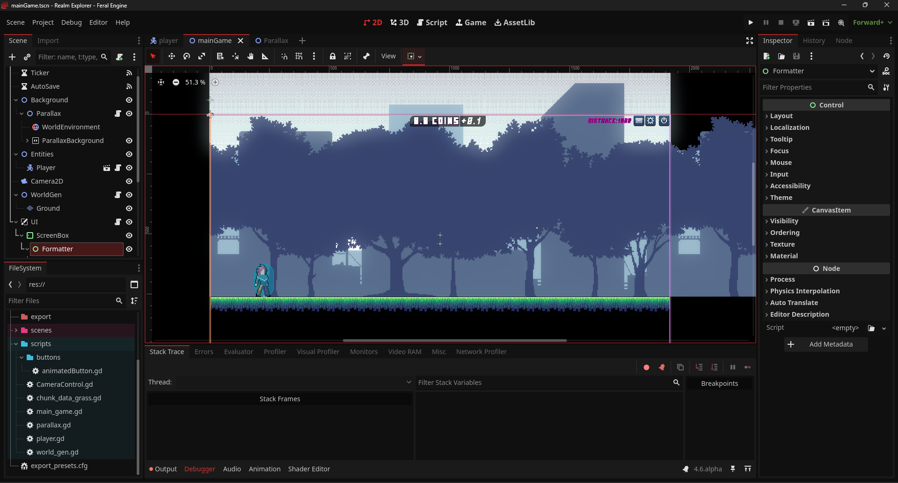

# Feral Engine

  

## 2D and 3D cross-platform game engine

**[Feral Engine](https://bp-feral.github.io/feral-engine/) is a feature-packed, cross-platform
game engine to create 2D and 3D games from a unified interface.** It provides a
comprehensive set of common tools, so that
users can focus on making games without having to reinvent the wheel. Games can
be exported with one click to a number of platforms, including the major desktop
platforms (Linux, macOS, Windows), mobile platforms (Android, iOS), as well as
Web-based platforms and consoles.

## Free, open source and community-driven

Feral is completely free and open source under the very permissive MIT license.
No strings attached, no royalties, nothing. The users' games are theirs, down
to the last line of engine code. Feral's development is fully independent and
community-driven, empowering users to help shape their engine to match their
expectations.

Before being open sourced in [February 2014](https://github.com/godotengine/godot/commit/0b806ee0fc9097fa7bda7ac0109191c9c5e0a1ac),
Godot had been developed by [Juan Linietsky](https://github.com/reduz) and
[Ariel Manzur](https://github.com/punto-) (both still maintaining the project)
for several years as an in-house engine, used to publish several work-for-hire
titles.

**Realm Explorer** - 2D Pixel idle incremental game by BlackPigeon

	

## Getting the engine

### Binary downloads

Official binaries for the Feral editor and the export templates can be found
[on the Feral website](https://bp-feral.github.io/feral-engine/).

### Compiling from source

[For the time being see the official docs](https://docs.godotengine.org/en/latest/engine_details/development/compiling)
for compilation instructions for every supported platform.

## Community and contributing

Feral is not only an engine but an ever-growing community of users and engine
developers. Please visit our [Discord Server](https://discord.gg/U5vz9Myn6F)!

The best way to get in touch with the core engine developers is to join the
[Godot Contributors Chat](https://chat.godotengine.org).

## Documentation and demos

The official documentation is hosted on [Read the Docs](https://docs.godotengine.org).
It is maintained by the Godot community in its own [GitHub repository](https://github.com/godotengine/godot-docs).

The [class reference](https://docs.godotengine.org/en/latest/classes/)
is also accessible from the Feral editor.

We also maintain official demos in their own [GitHub repository](https://github.com/godotengine/godot-demo-projects)
as well as a list of [awesome Godot community resources](https://github.com/godotengine/awesome-godot).

There are also a number of other
[learning resources](https://docs.godotengine.org/en/latest/community/tutorials.html)
provided by the community, such as text and video tutorials, demos, etc.
Consult the [community channels](https://godotengine.org/community)
for more information.

